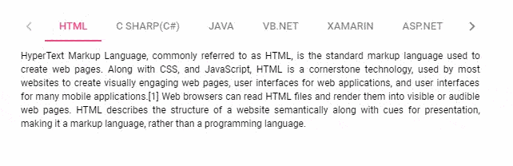
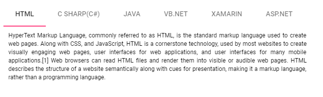

# Adaptive in ##Platform_Name## Tab control

The following section explains about rendering Tab when its width exceeds the viewable area or particularly in a given [`width`](../api/tab#width). The available modes are as follows:

* Scrollable
* Popup

## Scrollable

The default overflow mode is Scrollable. Scrollable display mode supports displaying the Tab header items in a single line with horizontal scrolling enabled, when the item overflows to the available space.

* The right and left navigation arrow is added at the start and end of the Tab header through which user can navigate towards overflowed items of the Tab header.
* You can also see the overflowed items using touch and swipe action on the header and content section.
* By default, navigation icon in the left direction is disabled, you can see the overflowed items by moving in the right direction.
* By clicking the arrow or by holding the arrow continuously, you can see the overflowed items.

* In devices the navigation icons are not available. You can touch and swipe to see the overflowed items of the Tab header.



 







        
















## Popup

The Popup is the another type of [`overflowMode`](../api/tab#overflowmode) in which the Tab container holds the items that can be placed within the available space. The rest of the overflowing items for which there is no space to fit within the viewing area are moved to overflow popup container.

* The items placed in popup can be viewed by opening the popup with the help of drop-down icon given at the end of the Tab header.

* If the popup height exceeds the height of the visible area, you can scroll through the popup items and select one.



 







        
















## See Also

* [How to prevent content swipe selection](./how-to/prevent-content-swipe-selection/)
* [Collapsible Tab](./how-to/create-collapsible-tabs/)